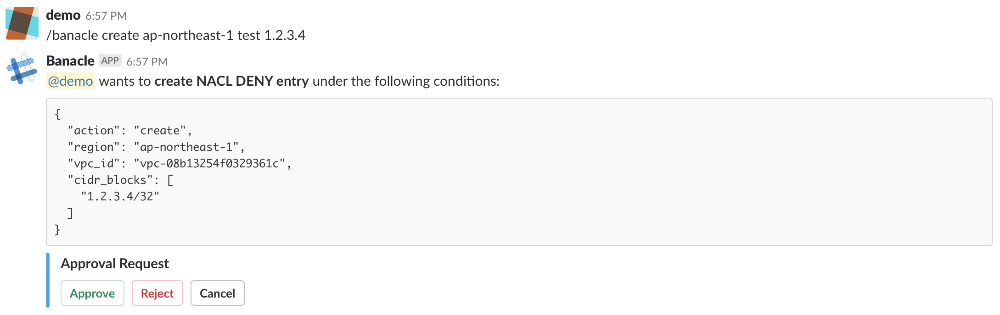
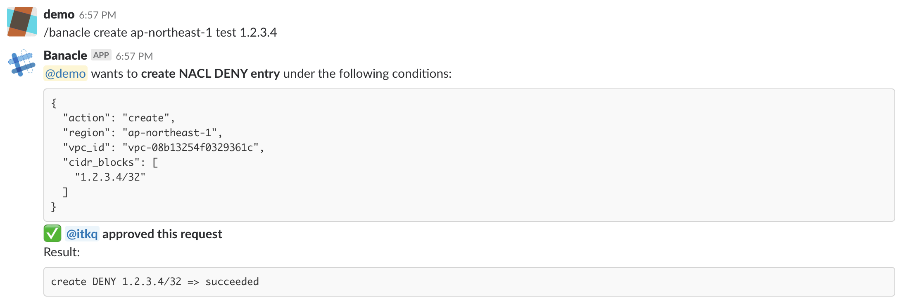
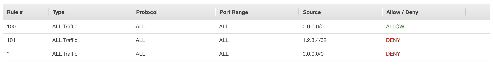

# Banacle: Create or delete DENY NACL ingress entries on AWS VPC as ChatOps (Slack Slash Command)

## Installation

Add this line to your application's Gemfile:

```ruby
gem 'banacle'
```

And then execute:

```
$ bundle
```

Or install it yourself as:

```
$ gem install banacle
```

## Usage

Banacle is supposed to be run as a Sinatra server. You can run it simply by `rackup` command. Banacle has two endpoints for Slack as follows:

- `/slack/command`: handle Slash Command
- `/slack/message`: handle Interactive Message

By default, the format of Slack Slash Command is: `/[cmd] [create or delete] [region] [vpc_id or vpc_name] [cidr_blocks]`

### Customize authentication
You can customize Banacle by using request handler modules.
See example directory which implements a customized authentication feature for details.

## Example: ban 1.2.3.4 from my VPC

Note: Use documentation block for testing. https://tools.ietf.org/html/rfc5737

Execute a command that create a DENY NACL ingress entry for 1.2.3.4 on a VPC named "test" in ap-northeast-1.



Then an approval request appears. Someone else can review the request and decide to approve or reject it. The requester can cancel the request. In this case, the request looks good so the reviewer clicks "Approve" button.



After approving the request, Banacle executes creating the NACL entry on the target VPC through the AWS API as follows.




## Development

After checking out the repo, run `bin/setup` to install dependencies. Then, run `rake spec` to run the tests. You can also run `bin/console` for an interactive prompt that will allow you to experiment.

To install this gem onto your local machine, run `bundle exec rake install`. To release a new version, update the version number in `version.rb`, and then run `bundle exec rake release`, which will create a git tag for the version, push git commits and tags, and push the `.gem` file to [rubygems.org](https://rubygems.org).

## Contributing

Bug reports and pull requests are welcome on GitHub at https://github.com/itkq/banacle.
